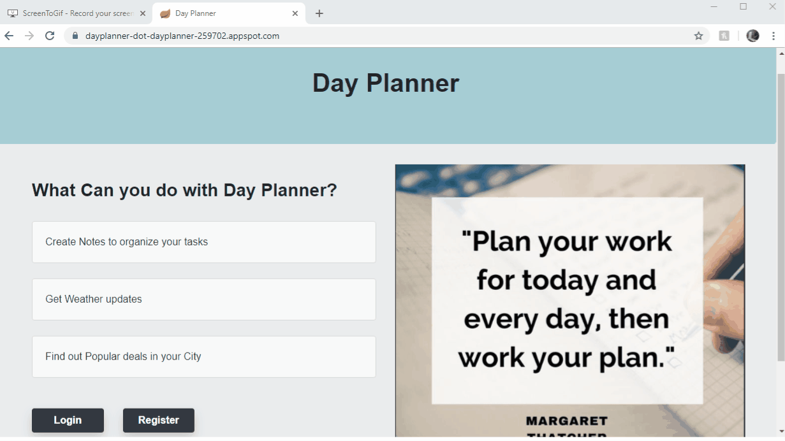

# Day_Planner_Application

**Motivation**: I usually start my day by creating to-do for the day and check weather so that I can clothe in accordingly and like most people, I check available deals online once in a while. This motivated me to create an application to see everything in one place which is very useful for myself and to some of my friends.

**Day Planner Application**:  One can Register , login , create Notes like to-do, shopping list etc.  check weather and deals based on the city info given during registration.

**Demo of Application**

**Features**
* Register
* Login
* Create Notes
* Validations 
* View saved Notes
* Delete Notes
* Displays weather in user City.
* Displays popular Deals in user city.

**What’s inside**
The project is built using Spring Boot, Spring MVC, Sping JPA,Hibernate, MYSQL, HTML, Bootstrap, JSP, Maven, Git

**Weather Data** :  Weather data is obtained from openweathermap API.

**Deals Data**:  By scraping redflagdeals.com, deals data is obtained.

The application is deployed in google cloud.

**Day Planner Application Link** : https://dayplanner-dot-dayplanner-259702.appspot.com/
